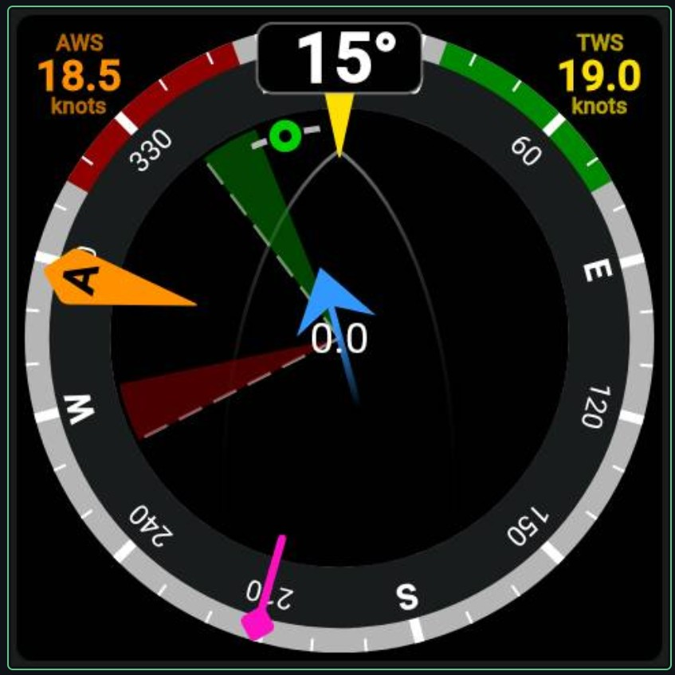
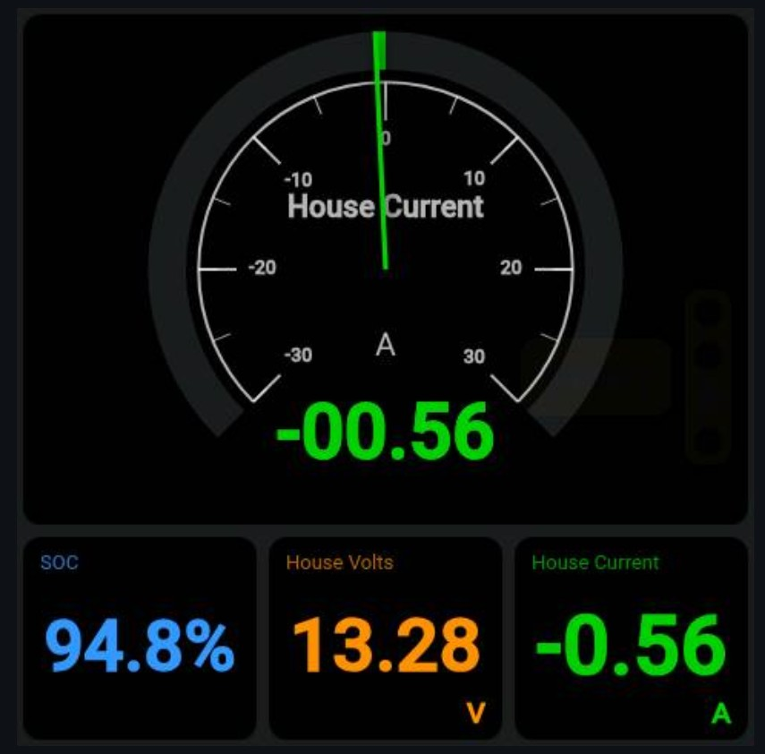
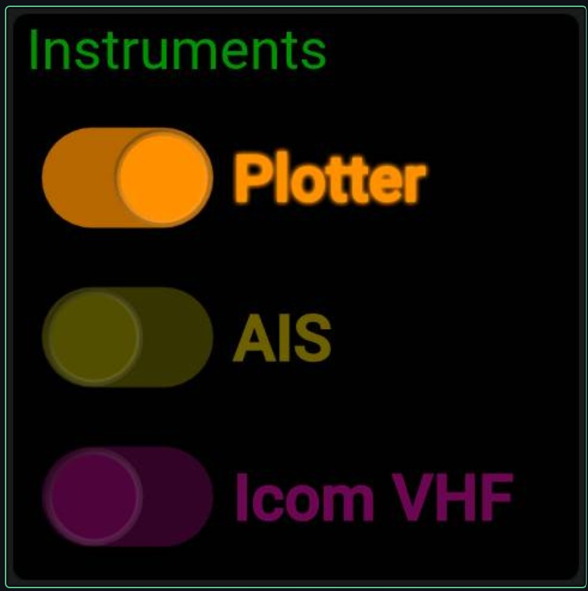

# KIPCast

Put live [KIP](https://github.com/mxtommy/Kip) dashboards on cheap ESP32 touchscreens around the boat.

<p>
  
  
  
</p>

<sub>KIP dashboards on the 4" 480×480 screen.</sub>

A Signal K plugin on the Raspberry Pi runs KIP in headless Chromium and streams it as JPEG frames over WiFi to Waveshare ESP32-S3 touchscreens: the 7" (800×480) and the 4" (480×480). Screens of both sizes can be used at once. Touches on the screen are sent back and injected into KIP as real touch events, so tapping, swiping between dashboards and KIP's menus all work as they do on a tablet.

```
 Raspberry Pi (Signal K)                          ESP32-S3 display
 ┌─────────────────────────────────┐   JPEG     ┌────────────────────┐
 │ signalk-kipcast                 │  frames    │ kipcast-display    │
 │  headless Chromium              │ ─────────▶ │  JPEGDEC → RGB LCD │
 │   one window per display id,    │  TCP 3051  │                    │
 │   each running KIP              │ ◀───────── │  GT911 touch       │
 │                                 │  touches   └────────────────────┘
 │  browser test viewer, port 3050 │
 └─────────────────────────────────┘
```

Each display has an id (for example `saloon` or `helm`). Each id gets its own KIP, drawn at that screen's size, with its own login and settings, so swiping to another dashboard on one screen doesn't change the others. Two displays with the same id show the same thing.

> **Status:** tested on a Pi 5 running Signal K with KIP 4.8, with a Waveshare 7" and a 4" Rev4 connected at the same time.

## Repository layout

| Folder | What it is |
|---|---|
| [`signalk-kipcast/`](signalk-kipcast/) | Signal K plugin (Node.js). Also runs on its own with `node standalone.js`. |
| [`kipcast-display/`](kipcast-display/) | PlatformIO firmware for the Waveshare ESP32-S3-Touch-LCD-7 and -4. |

## Quick start

1. **Install the plugin.** Install Chromium on the Pi (`sudo apt install chromium`), then install **KIPCast** from the Signal K App Store and enable it in **Server → Plugin Config → KIPCast**.
2. **Install the firmware on a screen.** Plug it into a computer and use the [web installer](https://g0kad.github.io/KIPCast/) in Chrome or Edge.
3. **Set up the screen.** It opens a WiFi network called `KIPCast-` and four characters. Join it on your phone and fill in the setup page: the boat's WiFi, and an id for the screen. The screen finds the Signal K server by itself.
4. **Build its dashboards.** Open **Webapps → KIPCast** in Signal K. See [Recommended workflow for a new screen size](#recommended-workflow-for-a-new-screen-size).

## Pi: install the plugin

Requirements: Signal K with KIP installed, Node.js 22.12 or later, and Chromium (`sudo apt install chromium`).

Install **KIPCast** from the App Store in the Signal K admin UI, or from npm: `cd ~/.signalk && npm install signalk-kipcast`. Then restart Signal K, go to **Server → Plugin Config → KIPCast**, enable it and save.

### Installing from a clone of this repository

```bash
git clone https://github.com/g0kad/KIPCast.git ~/KIPCast
cd ~/KIPCast/signalk-kipcast && npm ci --omit=dev
cd ~/.signalk && npm install ~/KIPCast/signalk-kipcast
sudo systemctl restart signalk
```

To update later: `cd ~/KIPCast && git pull`, run `npm ci --omit=dev` in `signalk-kipcast/`, then restart Signal K.

## Setting up each display

### The Displays page

In the Signal K admin UI, open **Webapps → KIPCast**. It lists every display the Pi knows about:

| Column | Shows |
|---|---|
| Display | The display id, as set on the screen's setup page. |
| Size | The resolution KIP is drawn at for that display. |
| Status | Whether the screen is connected, open in the viewer, or when it was last seen. |

**Open** takes you to the browser viewer for that display at its own size, which is where you set up its KIP. **Forget** removes a display from the list. Its KIP login and dashboards are kept, and a screen with that id adds itself back when it next connects.

Screens add themselves the first time they connect. To set up a display before its screen exists, use **Add a display**: enter the id you'll give the screen and pick its size (7" 800×480, 4" 480×480, or custom).

The page and its changes need a Signal K login. The plugin status in **Server → Plugin Config** also lists the connected screens and their sizes, for example `Connected: helm 480×480, shedtest 800×480`.

### How a display's size is chosen

1. **Reported by the screen.** Each ESP32 sends its resolution when it connects. The Pi remembers it in `displays.json` in the plugin's data folder.
2. **Remembered.** When the viewer opens a display id without its screen, it uses the remembered size, so dashboards are always laid out at the size the screen will show them.
3. **Default.** An id the Pi has never seen uses the plugin's default width and height (800×480).

For an id the Pi has never seen, the viewer can also set a size in its URL: `http://<pi>:3050/?id=helm&w=480&h=480`.

If a screen connects while its id is open in the viewer at a different size, the page is reopened at the screen's size. The viewer reconnects by itself a couple of seconds later.

### Logging in and choosing each display's dashboards

The ESP32 screens have no keyboard, so each display's KIP is set up in the browser viewer: open it from the Displays page, click the screen to give it keyboard focus, and type as normal. The first time, KIP shows its "Getting Started" guide and may ask you to log in to Signal K.

Each display id has its own browser profile, so its KIP login and settings are separate from other displays'. A new display id starts with a copy of the login and settings from the older shared profile (`chrome-profile`), if there is one. After that it's independent.

Where KIP keeps its dashboards depends on how it's logged in:

- **Logged in to Signal K:** KIP can save its configuration on the Signal K server, for that user. Every screen logged in as the same user loads the same dashboards.
- **Not logged in:** KIP keeps its configuration in that display's own browser profile.

So to give screens of different sizes their own dashboards, the simplest approach is **one Signal K user per screen size or role**, for example a `helm` user for the 4" screens and a `saloon` user for the 7" ones. Create the users in **Security → Users** in the Signal K admin UI, then log each display's KIP in as the right one. Screens that should show the same thing can share a user.

KIP's own profiles are another way to keep layouts apart within one user.

### Recommended workflow for a new screen size

Editing KIP's layout on the touchscreen itself is fiddly, so build the dashboards on a computer and use the screen only to check the result:

1. **Create a Signal K user for the screen size.** In **Security → Users**, add a user such as `kip480` for the 4" screens or `kip800` for the 7" ones.
2. **Build the dashboards in an ordinary browser.** On a computer, open KIP (`http://<pi>:3000/@mxtommy/kip/`), log in as that user, and add the dashboards and widgets and choose their Signal K paths. With a full-size window, mouse and keyboard this is much quicker than on the screen. A private window keeps this login separate from the one you normally use KIP with.
3. **Log the display in as the same user.** In **Webapps → KIPCast**, click **Open** for the display and log its KIP in as that user. The dashboards you just built load from the Signal K server.
4. **Fine-tune while watching the screen.** The viewer is drawn at the screen's exact size and everything you do in it appears on the screen straight away. Resize and move the widgets in the viewer until they read well on the screen itself.

Any other screen of the same size can then be logged in as the same user and gets the same dashboards.

### Designing dashboards for a small screen

A 480×480 screen has a little over half the pixels of an 800×480 one, and it's square. Some tips:

- Build separate dashboards for it rather than reusing the 7" ones. Do the final layout in the viewer opened from the Displays page, so you see exactly what the screen will show.
- Use fewer, larger widgets, for example a 2×2 grid of the numbers you read most at the helm.
- Keep touch targets large. A fingertip covers far more of a 4" screen than of a 7" one.
- Swiping between dashboards works the same on every size, so several simple dashboards beat one crowded one.

### The browser viewer

The viewer at `http://<pi>:3050/?id=<display id>` uses the same protocol as the ESP32, and mouse drags are sent as touches. Click the screen to give it keyboard focus, and your typing and pastes go to KIP. Its display id box suggests the displays the Pi knows about.

The viewer has no password of its own. Anyone who can reach port 3050 can use KIP as whichever user that display is logged in as, so only expose it on a network you trust. Adding and forgetting displays is only possible from the Displays page, behind the Signal K login.

### Plugin settings

| Setting | Default | Notes |
|---|---|---|
| Dashboard URL | `http://localhost:3000/@mxtommy/kip/` | Any web page works, not just KIP. |
| Default width / height | 800 × 480 | Only for a display id the Pi has never seen. ESP32 screens report their own size, which is remembered. See [How a display's size is chosen](#how-a-displays-size-is-chosen). |
| JPEG quality | 70 | Frames are typically 30–50 KB at 800×480. |
| Max frames per second | 8 | Per display. Frames are only sent when the page changes, so an idle dashboard sends very few. |
| Display TCP port | 3051 | Port the ESP32 connects to. |
| Browser viewer port | 3050 | Port for the test viewer. |
| Input mode | `touch` | Switch to `mouse` if a page ignores touch events. |
| Chromium path | auto | Checks `/usr/bin/chromium`, `chromium-browser` and `google-chrome`. If Chromium can't be found, the plugin still starts and says so in its status; displays can't connect until it's installed. |

A display's Chromium is shut down 5 minutes after its last screen disconnects, and starts again when a screen connects.

**Memory:** each connected display has its own Chromium, which used about 370 MB on a Pi 5 running KIP. Plan for that per screen alongside everything else the Pi runs. A display that has been off for 5 minutes uses nothing.

## ESP32: install the display firmware

### From your browser

The [web installer](https://g0kad.github.io/KIPCast/) flashes the latest release from Chrome or Edge over USB, with nothing to install. The images are also attached to each [GitHub release](https://github.com/g0kad/KIPCast/releases), to flash at offset 0x0 with `esptool`.

### The setup page

The firmware has no WiFi details built in. The first time it starts, the screen shows **KIPCast setup** and opens its own WiFi network, `KIPCast-` followed by the last four characters of its MAC address. Join it on a phone and the setup page opens; if it doesn't, browse to `http://192.168.4.1`. It asks for:

| Setting | Notes |
|---|---|
| WiFi network and password | The boat's WiFi. The page lists the networks the screen can see. |
| Display id | Letters, digits, `-` and `_`. Each id gets its own KIP on the Pi, and screens with the same id show the same thing. |
| Signal K server | Leave blank to find the Signal K server on the network (it announces itself over mDNS). Or enter the Pi's IP address or name. |

After saving, the screen restarts and connects. The settings are kept when the firmware is updated, unless you erase the flash.

To change the settings later, touch and hold the screen for two seconds while it shows **Starting** (for a couple of seconds after power-on) or any other status message. In setup, tapping the screen leaves without changes, and setup closes itself after 10 minutes.

### Building it yourself

Supported boards, each with its own PlatformIO environment:

| Board | Environment | Panel | Notes |
|---|---|---|---|
| [Waveshare ESP32-S3-Touch-LCD-7](https://www.waveshare.com/wiki/ESP32-S3-Touch-LCD-7) | `kipcast-display` (default) | 800×480 ST7262 | CH422G I/O expander |
| [Waveshare ESP32-S3-Touch-LCD-4](https://www.waveshare.com/wiki/ESP32-S3-Touch-LCD-4), Rev4.0 | `kipcast-display-4in` | 480×480 ST7701 | CH32V003 I/O expander. Earlier revisions use a TCA9554 and aren't supported yet. |

Both have an ESP32-S3 with 16 MB flash, 8 MB PSRAM and GT911 touch.

1. Install [PlatformIO](https://platformio.org/). The project uses the community [pioarduino](https://github.com/pioarduino/platform-espressif32) platform, because ESP32_Display_Panel v1.x needs Arduino core 3.x and the official platform is still on 2.x. PlatformIO downloads it automatically.
2. Optionally, build your details in so a freshly flashed screen skips the setup page:
   ```bash
   cd kipcast-display/include
   cp secrets.example.h secrets.h          # secrets.h is ignored by git
   ```
   Edit `secrets.h` and fill in your SSID, password and `DISPLAY_ID` (a different id for each screen), and `KIPCAST_HOST` if the screen shouldn't find the Pi by itself. If you build for both boards, `secrets.example.h` shows how to give each its own id. Anything saved on the setup page takes priority; `pio run -t erase` clears it.
3. Build and flash over the ESP32's native USB. On the 7" that's the USB-C port marked **USB**; the 4" has only one USB-C port.
   ```bash
   cd kipcast-display
   pio run -e kipcast-display -t upload        # 7"
   pio run -e kipcast-display-4in -t upload    # 4"
   pio device monitor
   ```
   Each build also writes `firmware.factory.bin`, the single image that the web installer uses.

Each board's panel config is in `include/boards/<board>/esp_panel_board_custom_conf.h`. The 7" config comes from Waveshare's `09_lvgl_v8_demo` example, and the 4" config from Waveshare's `esp32_s3_touch_lcd_4` board support package (both Apache-2.0). The build may warn that a config file is in an older format than the library expects. The newer settings it lacks don't apply to these boards, so the warning can be ignored.

**7" quirks:**
- If the USB port disappears (for example after running Waveshare's demo, which switches those pins to CAN), hold **BOOT** while plugging the cable in.
- One of the LCD data lines shares a pin with the ESP32's boot-mode pin, so after a reset or a flash the board can start in download mode with a blank screen. Unplug it and plug it back in.

### What the screen shows while connecting

| Screen | Meaning |
|---|---|
| Green, **KIPCast setup** | The setup page is open |
| Blue, **Starting** or **Joining WiFi** | Joining WiFi |
| Amber, **Looking for KIPCast** | WiFi up, trying to reach KIPCast on the Pi |
| Dashboard | Connected |

If it can't join the WiFi or find the Pi, the screen says so and suggests what to check.

The serial monitor (115200 baud) prints each step, plus frame size and decode time every 50 frames.

## Protocol

This is the same for the ESP32 (TCP) and the browser viewer (WebSocket), so other displays can be added easily.

**Display → Pi**: text lines ending in `\n`:

| Line | Meaning |
|---|---|
| `H <id> <width> <height>` | Hello. Must be the first line on TCP. The browser viewer passes the id as `/ws?id=` instead, and optionally a size as `&w=&h=`. |
| `A` | Ready for the next frame. The Pi sends nothing new until it gets this, so a slow display never builds up a backlog. |
| `T D <x> <y>` / `T M <x> <y>` / `T U <x> <y>` | Touch down / move / up, in display pixels. |
| `I <text>` | Type text into the focused field. `<text>` is URL-encoded (`encodeURIComponent`). |
| `K <key> [modifiers]` | Press a key: `Enter`, `Tab`, `Backspace`, `Escape`, `Delete`, `Home`, `End`, `PageUp`, `PageDown`, the arrow keys, or a letter/digit (for shortcuts such as Ctrl+A). Modifiers are a bitmask: Alt=1, Ctrl=2, Meta=4, Shift=8. |
| `P` | Keepalive. The ESP32 sends it after 10 s of silence. |

**Pi → display**:
- **TCP:** each frame is `KCF` + a 4-byte big-endian length + the JPEG bytes.
- **WebSocket:** each frame is one binary message.

If a display doesn't send `A` within 5 s, the Pi sends the next frame anyway.

**Display list (HTTP, JSON):**
- `GET http://<pi>:3050/displays`: read-only, used by the viewer.
- `GET /plugins/signalk-kipcast/displays` on Signal K: the same list plus the viewer port. Needs a Signal K login, as do the two below.
- `POST /plugins/signalk-kipcast/displays` with `{"id", "width", "height"}`: add or resize a display.
- `DELETE /plugins/signalk-kipcast/displays/<id>`: forget a display.

## Developing the plugin

Run it outside Signal K:

```bash
cd signalk-kipcast
npm ci
KIPCAST_URL=http://openplotter.local:3000/@mxtommy/kip/ node standalone.js
```

Environment variables:
- `KIPCAST_URL`
- `KIPCAST_QUALITY`
- `KIPCAST_FPS`
- `KIPCAST_INPUT` (`touch` or `mouse`)
- `KIPCAST_CHROMIUM`

The ports are fixed at 3050 and 3051 in this mode, so stop the plugin first.

## Licence

MIT. The board configs in `kipcast-display/include/boards/` are Apache-2.0 (Espressif Systems / Waveshare).

### Tests

```bash
cd signalk-kipcast
npm test
```

They use Node's built-in test runner and a stand-in for Chromium, so they need neither a browser nor a network, and run on Windows or macOS as well as the Pi. The test that uses a real TCP socket is skipped when `SIGNALK_REGISTRY_TEST` is set, as it is when the Signal K App Store tests plugins.
